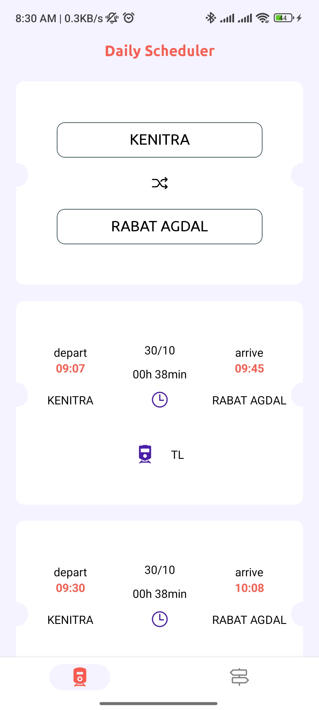
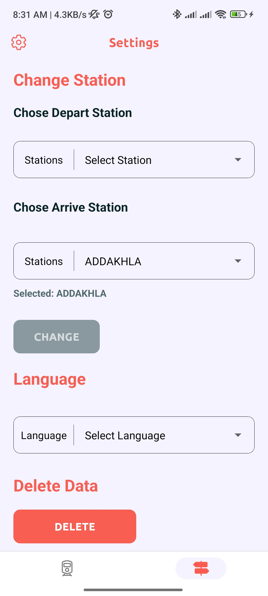

# Train Scheduler App

The Train Scheduler App is a convenient and user-friendly application designed for regular train commuters to access train schedules, check upcoming trains, and stay informed with real-time data. This app supports multiple languages, displays travel durations, and includes additional helpful features.

## Features

- **Real-Time Train Schedule**: View live train schedules for various lines and stations.
- **Next Train Information**: Instantly check the next available train based on your selected station.
- **Multi-Language Support**: Use the app in your preferred language.
- **Duration Display**: View estimated travel times for each route.
- **Favorites**: Save frequently used stations or routes for quick access.

## Screenshots

### Onboarding Screens
<p float="left">
  
  
  
</p>20### 20me and Settings Screens
<p float="left">
  
  
</p>

## Installation

### Prerequisites

- Node.js
- Expo CLI (for mobile development)

### Setup

1. Clone the repository:
    ```bash
    git clone https://github.com/Ayoub-b1/daily-Scheduler.git
    cd train-scheduler-app
    ```

2. Install dependencies:
    ```bash
    npm install
    ```

3. Run the app in development mode:
    ```bash
    npx expo start
    ```

## Usage

- Start the app on a mobile device or emulator.
- Select your preferred language in settings.
- Search for train schedules by station or route.
- Save favorite stations or routes for easy access.

## Technologies Used

- **React Native & Expo** for cross-platform app development.
- **Localization** for multi-language support.
- **API Integration** for real-time train schedule data.

## Contributing

1. Fork the repository.
2. Create a new branch:
    ```bash
    git checkout -b feature-branch
    ```
3. Commit your changes and push them:
    ```bash
    git push origin feature-branch
    ```
4. Open a pull request.

## License

This project is licensed under the MIT License.

## Contact

For questions or feedback, please reach out via email at ayoub.bourhfella1@gmail.com


